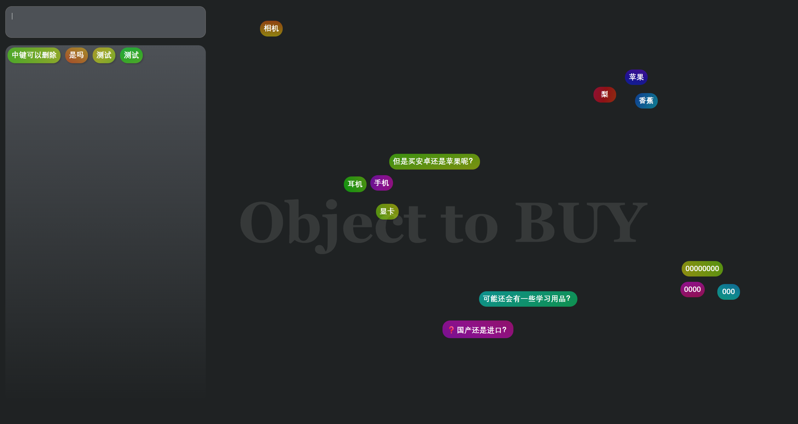

# 极简头脑风暴工具

[在线体验](https://reddouofficial.github.io/Brainstorming/)

## Trigger

市面上头脑风暴工具往往需要不停点击鼠标在意操作,但实际上头脑风暴往往只需要捕捉词汇
我希望能忘记操作，沉浸迅速头脑风暴。

## Feature

- 操作简单--不打断思考。主要功能就三个：
  1.  新建节点: 输入内容 + `Enter`
      - 换行: `Shift + Enter`
  2.  删除节点：鼠标中键单击
  3.  调整位置: 左键拖拽

其他：

1. `T` 设置标题
2. 双击卡片会搜索
3. `Ctrl + Shift + D` 清空所有节点。但暂时需要手动刷新一下
4. 侧边拖动调整宽度
5. 卡片在侧栏区域自动吸附变成规矩排列，拖出去变成自由排列

## 设计理念

- 操作简单--不打断思考，
- 界面极简---减少繁杂干扰思考
- 配色多样——辅助记忆空间位置，同时颜色能刺激灵感（甚至可以形状随机，三角形，但是这样配色已经可以了，形状反而干扰了）

## Notes

- “节点编辑” 功能暂时没有，因为词汇往往很短，完全可以直接删掉后重新输入。
- 不必担心重叠盖住：背景带有透明度，遮盖往往会发现异常的
